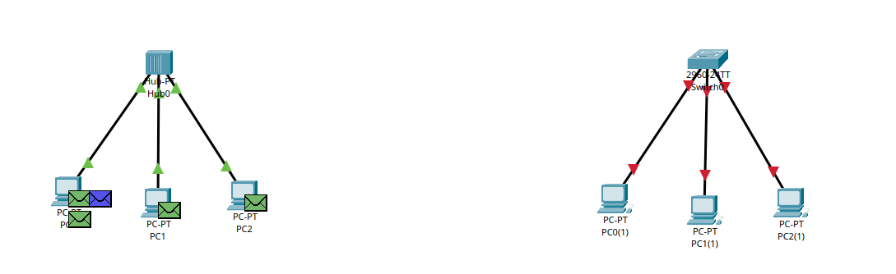
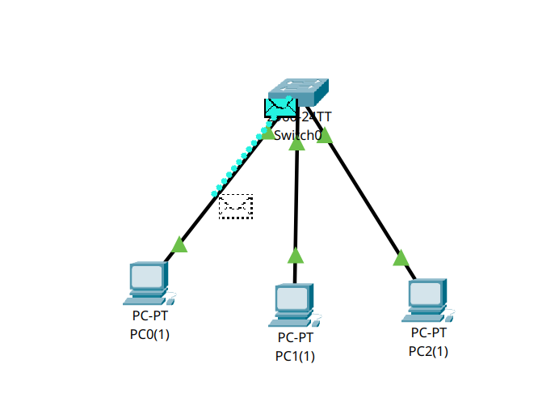

# Ponderada packettracer - M9

Link do vídeo: [aqui](https://drive.google.com/file/d/1rociQAoOX-zfoKBeVIBAtLePcOok0tuW/view?usp=sharing)

Parte 1:

a) Por que todos os nós recebem o quadro inicialmente dentro de um hub?

Porque o hub não consegue identificar para qual dispositivo o quadro deve ir. Ele apenas recebe o sinal e retransmite para todas as máquinas conectadas. Assim, todos os nós recebem o quadro, mas só o destinatário correto o aceita.

b) Explique como isso se relaciona ao conceito de meio compartilhado com desempenho real na camada física.

Isso acontece porque, no hub, todos os dispositivos compartilham o mesmo meio físico de transmissão. Ou seja, todos usam o mesmo canal para enviar dados. Na prática, isso pode causar colisões quando dois dispositivos tentam transmitir ao mesmo tempo, o que reduz o desempenho da rede e gera retransmissões.

---

Parte 2:
a) Compare o fluxo do sinal elétrico no switch versus hub.

No hub, o sinal que entra por uma porta é repetido para todas as outras, sem controle de destino. Por isso, todos os dispositivos recebem o mesmo sinal.

No switch, o funcionamento é mais inteligente. Ele identifica os endereços MAC dos dispositivos e aprende em qual porta cada um está conectado. Assim, depois de aprender a rede, ele passa a enviar os quadros apenas para a porta do destinatário, tornando a comunicação mais eficiente.

b) Por que agora a PDU não é propagada para todos os nós da mesma forma?

Porque o switch já consegue identificar para qual dispositivo o quadro deve ser enviado. Ele usa a tabela MAC para encaminhar a PDU apenas para a porta correta, em vez de mandar para todos os nós como o hub faz.

Mesmo assim, durante a simulação, ainda podem aparecer quadros de controle, como os do STP, que o switch envia para monitorar a rede.

c) O switch elimina o meio físico compartilhado? Justifique tecnicamente.

Não totalmente. Os dispositivos continuam ligados na mesma rede física, mas o switch organiza melhor a comunicação. Cada porta do switch funciona como um domínio de colisão separado, o que reduz colisões e melhora o desempenho.

Diferente do hub, o switch não retransmite tudo para todos. Ele analisa o endereço MAC de destino e encaminha o quadro somente para o dispositivo correto, tornando a rede mais eficiente.

